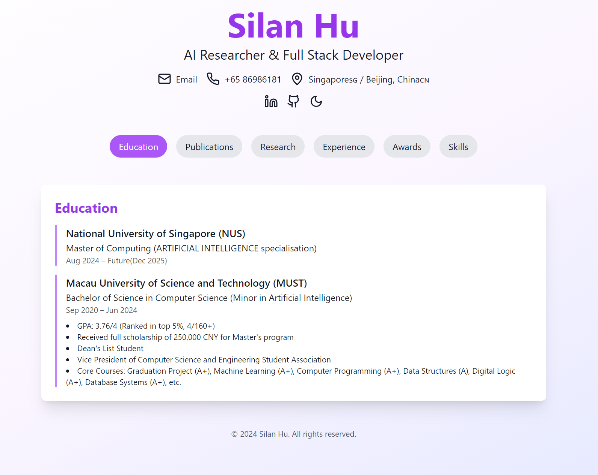

# AIPro-Resume

A modern, interactive, and SEO-optimized personal resume website for AI professionals and full-stack developers.

## Overview

AIPro-Resume is an open-source project that showcases a cutting-edge personal resume website built with React and optimized for AI researchers and full-stack developers. This project demonstrates best practices in web development, SEO optimization, and personal branding for tech professionals.

## Key Features

- Responsive design using React and Tailwind CSS
- Interactive 3D elements powered by Three.js
- Dark/Light mode toggle with system preference detection
- SEO-optimized structure with meta tags and Schema.org markup
- Smooth animations and transitions using Framer Motion
- Easily customizable sections for education, experience, projects, and skills
- Blog post showcase with dynamic content loading
- Integration with professional social media profiles

## Technologies Used

- React
- Tailwind CSS
- Three.js
- Framer Motion
- Node.js
- Docker (for easy deployment)

## Getting Started

[Include instructions on how to clone, install dependencies, and run the project locally]

## Customization

[Provide guidance on how users can customize the resume content, styling, and features]

## Deployment

[Explain how to deploy the project, including Docker and Nginx configuration tips]

## Contributing

Contributions are welcome! Please feel free to submit a Pull Request.

## License

This project is open source and available under the [MIT License](LICENSE).

## Author

Created by Silan Hu - AI Researcher & Full Stack Developer

[silan-hu-profile-website](https://silan.tech/)
