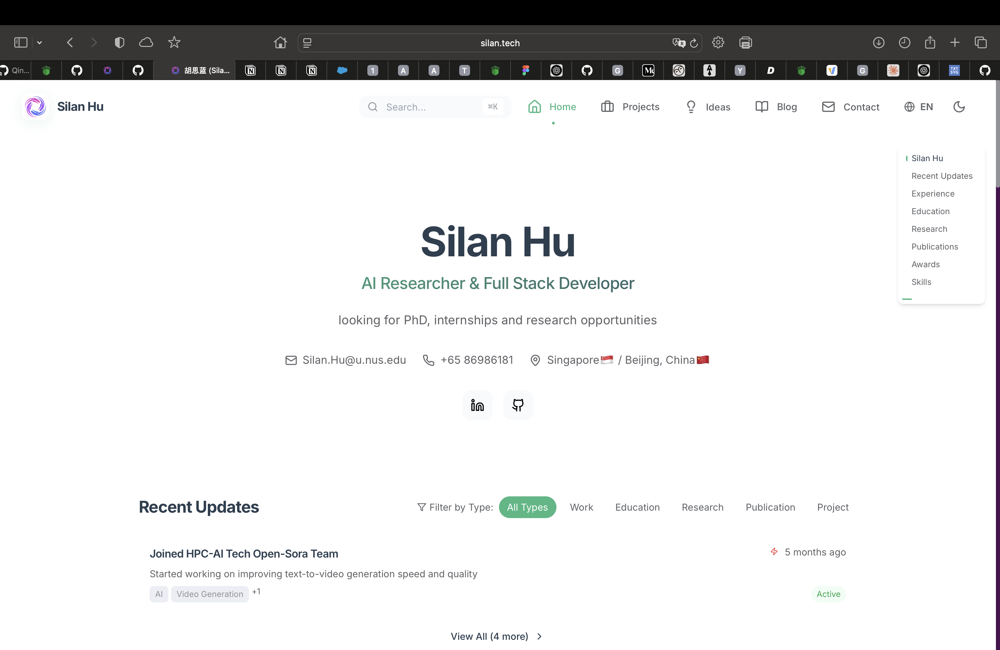

# AIPro-Resume

A modern, interactive, and SEO-optimized personal resume website platform for AI professionals and full-stack developers. This project showcases a comprehensive full-stack application with hybrid database architecture, modern frontend technologies, and enterprise-grade backend services.



## 🚀 Project Overview

AIPro-Resume is a comprehensive portfolio and resume platform designed specifically for AI researchers, data scientists, and full-stack developers. The platform combines modern web technologies with robust backend services to create a professional, interactive, and highly customizable personal website.

### Key Features

- **🎨 Modern React Frontend** - Interactive UI with TypeScript, Tailwind CSS, and Framer Motion
- **⚡ High-Performance Backend** - Go-Zero microservices architecture with Ent ORM
- **🗄️ Hybrid Database System** - MySQL for structured data, Redis for caching
- **🔧 Python CLI Tools** - Advanced content management and database synchronization
- **🐳 Docker Containerization** - Complete development and production environments
- **📱 Responsive Design** - Mobile-first approach with progressive enhancement
- **🌐 Multi-language Support** - i18n implementation for global accessibility
- **📊 Analytics & Monitoring** - Prometheus and Grafana integration

## 🏗️ Architecture

### Frontend Stack

- **React 18** with TypeScript
- **Vite** for fast development and building
- **Tailwind CSS** for styling
- **Framer Motion** for animations
- **Three.js** for 3D visualizations
- **Recharts** for data visualization
- **Chakra UI** for component library

### Backend Stack

- **Go-Zero** microservices framework
- **Ent ORM** for database management
- **MySQL 8.0** for primary database
- **Redis** for caching and session management
- **JWT** for authentication
- **OpenTelemetry** for observability

### DevOps & Tools

- **Docker & Docker Compose** for containerization
- **Python CLI** for content management
- **Nginx** for reverse proxy (production)
- **Prometheus & Grafana** for monitoring
- **GitHub Actions** for CI/CD

## 📁 Project Structure

```
AIPro-Resume/
├── README.md                           # Project documentation
├── package.json                        # Frontend dependencies
├── vite.config.ts                      # Vite configuration
├── tailwind.config.js                  # Tailwind CSS config
├── tsconfig.json                       # TypeScript configuration
├── 
├── src/                                # Frontend source code
│   ├── components/                     # React components
│   │   ├── Resume/                     # Resume-specific components
│   │   ├── BlogStack/                  # Blog system components
│   │   ├── ProjectGallery/             # Project showcase components
│   │   ├── IdeaPage/                   # Research ideas components
│   │   └── ui/                         # Reusable UI components
│   ├── api/                            # API integration layer
│   ├── views/                          # Page components
│   ├── layout/                         # Layout components
│   ├── types/                          # TypeScript type definitions
│   ├── utils/                          # Utility functions
│   └── i18n/                           # Internationalization
│
├── backend/                            # Backend services
│   ├── hybrid-database-system/         # Main backend system
│   │   ├── go-backend/                 # Go-Zero microservices
│   │   │   ├── internal/               # Internal packages
│   │   │   │   ├── config/             # Configuration
│   │   │   │   ├── handler/            # HTTP handlers
│   │   │   │   ├── logic/              # Business logic
│   │   │   │   ├── svc/                # Service context
│   │   │   │   ├── types/              # Type definitions
│   │   │   │   ├── middleware/         # HTTP middleware
│   │   │   │   └── ent/                # Ent ORM generated code
│   │   │   │       └── schema/         # Database schema definitions
│   │   │   ├── api/                    # API definitions
│   │   │   ├── etc/                    # Configuration files
│   │   │   └── docker-compose.yml      # Container orchestration
│   │   ├── mysql/                      # MySQL initialization
│   │   └── monitoring/                 # Prometheus & Grafana config
│   └── simple-file-system/             # Python CLI tools
│       ├── silan/                      # CLI package
│       │   ├── commands/               # CLI commands
│       │   ├── models/                 # Data models
│       │   ├── parsers/                # Content parsers
│       │   └── utils/                  # Utility functions
│       └── requirements.txt            # Python dependencies
│
├── public/                             # Static assets
├── docs/                               # Documentation
└── dist/                               # Build output
```

## 🚀 Quick Start

### Prerequisites

- Node.js 18+ and npm
- Go 1.23+
- Python 3.9+
- Docker and Docker Compose
- MySQL 8.0 (or use Docker)

### 1. Clone the Repository

```bash
git clone https://github.com/silan-hu/AIPro-Resume.git
cd AIPro-Resume
```

### 2. Frontend Setup

```bash
# Install dependencies
npm install

# Start development server
npm run dev

# Build for production
npm run build
```

### 3. Backend Setup (Go-Zero)

```bash
cd backend/hybrid-database-system/go-backend

# Install Go dependencies
go mod download

# Generate Ent code
ent generate ./internal/ent/schema

# Start the server
go run backend.go
```

### 4. Python CLI Setup

```bash
cd backend/simple-file-system

# Create virtual environment
python -m venv venv
source venv/bin/activate  # On Windows: venv\Scripts\activate

# Install dependencies
pip install -r requirements.txt

# Install CLI tool
pip install -e .

# Use the CLI
silan --help
```

### 5. Docker Setup (Recommended)

```bash
cd backend/hybrid-database-system

# Start all services
docker-compose up -d

# Start with monitoring
docker-compose --profile monitoring up -d

# Start development environment
docker-compose --profile dev up -d
```

## 🛠️ Development

### Frontend Development

```bash
# Start development server
npm run dev

# Lint code
npm run lint

# Fix linting issues
npm run lint:fix

# Build for production
npm run build
```

### Backend Development

```bash
# Generate API code
goctl api go -api api/backend.api -dir .

# Generate Ent schema
ent generate ./internal/ent/schema

# Run tests
go test ./...

# Build binary
go build -o bin/backend backend.go
```

### Python CLI Development

```bash
# Install in development mode
pip install -e .

# Run tests
pytest

# Format code
black silan/

# Type checking
mypy silan/
```

## 📊 Database Schema

The project uses a hybrid database approach:

### MySQL Entities

- **User** - User profiles and authentication
- **PersonalInfo** - Personal information and contact details
- **Education** - Educational background
- **WorkExperience** - Professional experience
- **Projects** - Portfolio projects with details and technologies
- **BlogPosts** - Blog articles with categories and tags
- **Ideas** - Research ideas and concepts
- **Publications** - Academic publications and papers
- **Awards** - Professional awards and achievements

### Redis Caching

- Session management
- API response caching
- Real-time data caching
- Rate limiting

## 🔌 API Endpoints

### Resume Endpoints

- `GET /api/resume/data` - Complete resume data
- `GET /api/resume/personal-info` - Personal information
- `GET /api/resume/education` - Education history
- `GET /api/resume/work-experience` - Work experience
- `GET /api/resume/projects` - Projects list
- `GET /api/resume/publications` - Publications list
- `GET /api/resume/awards` - Awards list

### Blog Endpoints

- `GET /api/blog/posts` - Blog posts with pagination
- `GET /api/blog/post/:id` - Single blog post
- `GET /api/blog/categories` - Blog categories
- `GET /api/blog/tags` - Blog tags
- `GET /api/blog/search` - Search blog posts

### Project Endpoints

- `GET /api/projects` - Projects list
- `GET /api/projects/:id` - Project details
- `GET /api/projects/categories` - Project categories
- `GET /api/projects/tags` - Project tags

### Ideas Endpoints

- `GET /api/ideas` - Research ideas
- `GET /api/ideas/:id` - Idea details
- `GET /api/ideas/categories` - Idea categories

## 🌐 Deployment

### Production Deployment

```bash
# Build frontend
npm run build

# Build backend
cd backend/hybrid-database-system/go-backend
go build -o bin/backend backend.go

# Deploy with Docker
docker-compose --profile production up -d
```

### Environment Variables

```env
# Database
MYSQL_ROOT_PASSWORD=root_password
MYSQL_PASSWORD=silan_password
DB_HOST=mysql
DB_PORT=3306
DB_NAME=silan_website
DB_USER=silan

# Redis
REDIS_HOST=redis
REDIS_PORT=6379

# JWT
JWT_SECRET=your_jwt_secret_key_here
JWT_EXPIRE=3600

# Server
PORT=8080
MODE=production

# Monitoring
GRAFANA_PASSWORD=admin
```

```
api-test-portfolio/
├── workspace.yaml                          # 统一配置文件
├── content/
│   ├── projects/                          # 基于文件夹的项目
│   │   ├── ai-chatbot/                    # AI聊天机器人
│   │   │   ├── README.md, config.yaml
│   │   │   ├── assets/architecture-diagram.md
│   │   │   └── notes/meeting-notes.md
│   │   ├── ecommerce-platform/            # 电商平台
│   │   └── data-visualization-tool/       # 数据可视化工具
│   ├── ideas/                             # 研究导向的想法
│   │   ├── quantum-ml-framework/          # 量子机器学习框架
│   │   │   ├── README.md, config.yaml
│   │   │   ├── research/literature-review.md
│   │   │   └── experiments/vqe-experiment.md
│   │   └── ai-code-refactoring-tool/      # AI代码重构工具
│   │       ├── README.md, config.yaml
│   │       ├── references/literature-survey.md
│   │       └── prototypes/ast-analyzer.md
│   ├── updates/                           # 时间轴更新
│   │   └── 2024/
│   │       ├── 01/2024-01-01-ziyun2024-plan-launch.md
│   │       ├── 03/2024-03-31-q1-milestone-achieved.md
│   │       ├── 06/2024-06-15-ai-chatbot-beta-release.md
│   │       ├── 09/2024-09-15-quantum-ml-research-progress.md
│   │       └── 12/2024-12-19-workspace-upgrade-complete.md
│   └── blog/
│       ├── posts/2024-12-19-workspace-evolution.md
│       └── drafts/2024-12-20-quantum-ml-future.md
├── templates/                             # 内容模板
│   ├── projects/web-app.yaml, web-app-readme.md
│   ├── ideas/research-idea.yaml
│   ├── updates/milestone.md
│   └── blog/technical-post.md
└── .silan/                                # 系统数据
    ├── cache/README.md
    ├── logs/README.md
    ├── analytics/workspace_stats.json
    ├── config/local.yaml
    └── temp/.gitkeep
```

## 📈 Monitoring

The project includes comprehensive monitoring:

- **Prometheus** - Metrics collection (http://localhost:9090)
- **Grafana** - Visualization dashboards (http://localhost:3000)
- **Health Checks** - Service health monitoring
- **Logging** - Structured logging with OpenTelemetry

## 🧪 Testing

### Frontend Testing

```bash
# Run tests (when configured)
npm test

# E2E tests
npm run test:e2e
```

### Backend Testing

```bash
# Run Go tests
go test ./...

# Run with coverage
go test -cover ./...
```

### Python Testing

```bash
# Run pytest
pytest

# Run with coverage
pytest --cov=silan
```

## 🤝 Contributing

1. Fork the repository
2. Create a feature branch (`git checkout -b feature/amazing-feature`)
3. Commit your changes (`git commit -m 'Add amazing feature'`)
4. Push to the branch (`git push origin feature/amazing-feature`)
5. Open a Pull Request

## 📝 License

This project is licensed under the MIT License - see the [LICENSE](LICENSE) file for details.

## Author

**Silan Hu** - AI Researcher & Full Stack Developer

- Website: [silan.tech](https://silan.tech/)
- GitHub: [@Qingbolan](https://github.com/Qingbolan)
- LinkedIn: [Silan Hu](https://linkedin.com/in/Qingbolan)

## Acknowledgments

- Go-Zero framework for microservices architecture
- Ent ORM for database management
- React ecosystem for frontend development
- Docker for containerization
- All open source contributors

---

⭐ If you find this project helpful, please give it a star!
