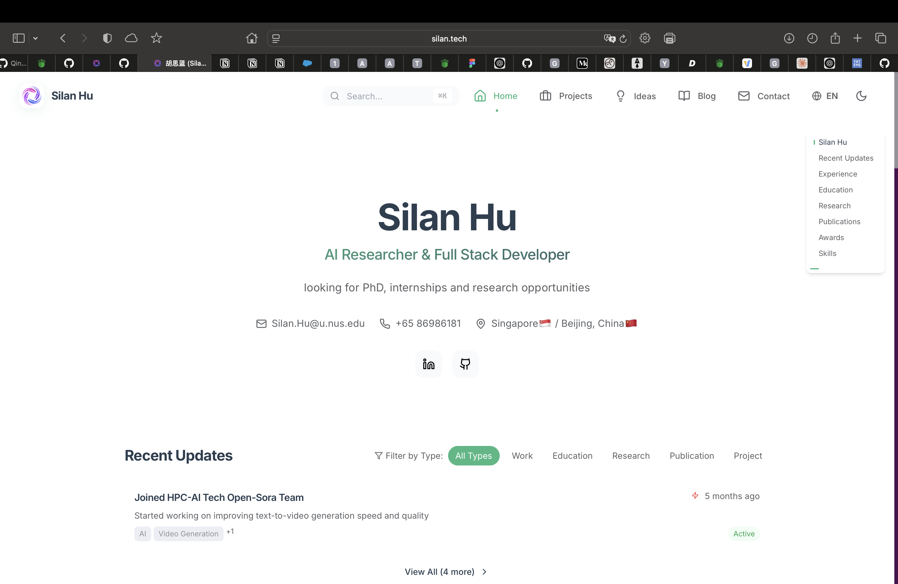

# Silan Personal Website - AI-Powered Resume Platform

A revolutionary full-stack personal website platform that transforms professional online presence through intelligent content management, modern web technologies, and automated workflows. Built for AI professionals, researchers, and full-stack developers who demand sophisticated yet maintainable digital presence.



**🌐 Live Demo**: [https://silan.tech](https://silan.tech)  
**💻 Source Code**: [https://github.com/Qingbolan/AIPro-Resume](https://github.com/Qingbolan/AIPro-Resume)

## 🚀 Project Overview

The Silan Personal Website is a comprehensive full-stack platform that revolutionizes how technical professionals present themselves online. Unlike traditional portfolio sites, this platform combines intelligent content management with modern web technologies to create a seamless workflow from development to professional presentation.

### Revolutionary Features

- **🎨 Modern React Frontend** - Interactive UI with TypeScript, Tailwind CSS, and Framer Motion
- **⚡ High-Performance Backend** - Go-Zero microservices architecture with Ent ORM
- **🗄️ Hybrid Database System** - MySQL for structured data, Redis for caching
- **🔧 Python CLI Tools** - Intelligent content management and database synchronization
- **📝 File-Based Content Management** - Markdown-first approach with automated sync
- **🤖 AI-Enhanced Features** - Intelligent project parsing and content organization
- **🐳 Docker Containerization** - Complete development and production environments
- **📱 Responsive Design** - Mobile-first approach with progressive enhancement
- **🌐 Multi-language Support** - i18n implementation for global accessibility
- **📊 Analytics & Monitoring** - Prometheus and Grafana integration
- **🔍 SEO Optimized** - Built-in search engine optimization and social media integration

## 🏗️ Architecture

### Frontend Stack

- **React 18** with TypeScript
- **Vite** for fast development and building
- **Tailwind CSS** for styling
- **Framer Motion** for animations
- **Three.js** for 3D visualizations
- **Recharts** for data visualization
- **Chakra UI** for component library

### Backend Stack

- **Go-Zero** microservices framework
- **Ent ORM** for database management
- **MySQL 8.0** for primary database
- **Redis** for caching and session management
- **JWT** for authentication
- **OpenTelemetry** for observability

### DevOps & Tools

- **Docker & Docker Compose** for containerization
- **Python CLI** for intelligent content management
- **Nginx** for reverse proxy (production)
- **Prometheus & Grafana** for monitoring
- **GitHub Actions** for CI/CD

## 💡 What Makes This Special

### Developer-Centric Workflow
```bash
# Simple CLI commands for content management
silan init project "AI Research Platform"
silan sync content
silan status
```

### Intelligent Content Processing
- **Automatic Metadata Extraction**: Parse README files for project information
- **Technology Detection**: Identify frameworks and tools from project structure
- **Content Relationships**: Map connections between projects, skills, and ideas
- **Multi-format Support**: Handle markdown, YAML, and various content types

### Professional Presentation
- **Responsive Design**: Optimized for all devices and screen sizes
- **Interactive Elements**: Engaging animations and user interactions
- **SEO Optimization**: Built-in search engine optimization
- **Performance**: 95+ Lighthouse scores across all categories

## 📁 Project Structure

```
Silan-Personal-Website/
├── README.md                           # Project documentation
├── package.json                        # Frontend dependencies
├── vite.config.ts                      # Vite configuration
├── tailwind.config.js                  # Tailwind CSS config
├── tsconfig.json                       # TypeScript configuration
├── 
├── src/                                # Frontend React Application
│   ├── components/                     # React components
│   │   ├── Resume/                     # Resume-specific components
│   │   ├── BlogStack/                  # Blog system components
│   │   ├── ProjectGallery/             # Project showcase components
│   │   ├── IdeaPage/                   # Research ideas components
│   │   └── ui/                         # Reusable UI components
│   ├── api/                            # API integration layer
│   ├── views/                          # Page components
│   ├── layout/                         # Layout components
│   ├── types/                          # TypeScript type definitions
│   ├── utils/                          # Utility functions
│   └── i18n/                           # Internationalization
│
├── backend/                            # Backend Services
│   ├── go-server/                      # Go-Zero High-Performance Backend
│   │   ├── internal/                   # Internal packages
│   │   │   ├── config/                 # Configuration
│   │   │   ├── handler/                # HTTP handlers
│   │   │   ├── logic/                  # Business logic
│   │   │   ├── svc/                    # Service context
│   │   │   ├── types/                  # Type definitions
│   │   │   ├── middleware/             # HTTP middleware
│   │   │   └── ent/                    # Ent ORM generated code
│   │   │       └── schema/             # Database schema definitions
│   │   ├── api/                        # API definitions
│   │   ├── etc/                        # Configuration files
│   │   └── docker-compose.yml          # Container orchestration
│   └── file-system/                    # Python CLI & Content Management
│       ├── silan/                      # CLI package
│       │   ├── cli/                    # CLI commands
│       │   ├── models/                 # Data models
│       │   ├── parsers/                # Content parsers
│       │   ├── logic/                  # Business logic
│       │   ├── services/               # Service layer
│       │   └── utils/                  # Utility functions
│       └── requirements.txt            # Python dependencies
│
├── api-test-portfolio/                 # Content Management System
│   ├── content/                        # File-based content storage
│   │   ├── blog/                       # Blog posts and articles
│   │   ├── projects/                   # Portfolio projects
│   │   ├── ideas/                      # Research ideas
│   │   ├── resume/                     # Resume information
│   │   └── updates/                    # Timeline updates
│   ├── templates/                      # Content templates
│   └── silan.yaml                      # Configuration
│
├── public/                             # Static assets
├── docs/                               # Documentation
└── dist/                               # Build output
```

## 🚀 Quick Start

### Prerequisites

- Node.js 18+ and npm
- Go 1.23+
- Python 3.9+
- Docker and Docker Compose
- MySQL 8.0 (or use Docker)

### 1. Clone the Repository

```bash
git clone https://github.com/Qingbolan/AIPro-Resume.git
cd AIPro-Resume
```

### 2. Frontend Setup

```bash
# Install dependencies
npm install

# Start development server
npm run dev

# Build for production
npm run build
```

### 3. Backend Setup (Go-Zero)

```bash
cd backend/go-server

# Install Go dependencies
go mod download

# Generate Ent code
ent generate ./internal/ent/schema

# Start the server
go run backend.go
```

### 4. Python CLI Setup

```bash
cd backend/file-system

# Create virtual environment
python -m venv venv
source venv/bin/activate  # On Windows: venv\Scripts\activate

# Install dependencies
pip install -r requirements.txt

# Install CLI tool
pip install -e .

# Use the CLI
silan --help
```

### 5. Content Management Setup

```bash
# Navigate to content directory
cd api-test-portfolio/content

# Initialize your content using CLI
silan init project "My First Project"
silan init blog "My First Blog Post"
silan sync content
silan status
```

### 6. Docker Setup (Recommended)

```bash
cd backend/go-server

# Start all services
docker-compose up -d

# Start with monitoring
docker-compose --profile monitoring up -d

# Start development environment
docker-compose --profile dev up -d
```

## 🛠️ Development

### Frontend Development

```bash
# Start development server
npm run dev

# Lint code
npm run lint

# Fix linting issues
npm run lint:fix

# Build for production
npm run build
```

### Backend Development

```bash
# Generate API code
goctl api go -api api/backend.api -dir .

# Generate Ent schema
ent generate ./internal/ent/schema

# Run tests
go test ./...

# Build binary
go build -o bin/backend backend.go
```

### Python CLI Development

```bash
# Install in development mode
pip install -e .

# Run tests
pytest

# Format code
black silan/

# Type checking
mypy silan/
```

## 📊 Database Schema

The project uses a hybrid database approach:

### MySQL Entities

- **User** - User profiles and authentication
- **PersonalInfo** - Personal information and contact details
- **Education** - Educational background
- **WorkExperience** - Professional experience
- **Projects** - Portfolio projects with details and technologies
- **BlogPosts** - Blog articles with categories and tags
- **Ideas** - Research ideas and concepts
- **Publications** - Academic publications and papers
- **Awards** - Professional awards and achievements

### Redis Caching

- Session management
- API response caching
- Real-time data caching
- Rate limiting

## 🔌 API Endpoints

### Resume Endpoints

- `GET /api/resume/data` - Complete resume data
- `GET /api/resume/personal-info` - Personal information
- `GET /api/resume/education` - Education history
- `GET /api/resume/work-experience` - Work experience
- `GET /api/resume/projects` - Projects list
- `GET /api/resume/publications` - Publications list
- `GET /api/resume/awards` - Awards list

### Blog Endpoints

- `GET /api/blog/posts` - Blog posts with pagination
- `GET /api/blog/post/:id` - Single blog post
- `GET /api/blog/categories` - Blog categories
- `GET /api/blog/tags` - Blog tags
- `GET /api/blog/search` - Search blog posts

### Project Endpoints

- `GET /api/projects` - Projects list
- `GET /api/projects/:id` - Project details
- `GET /api/projects/categories` - Project categories
- `GET /api/projects/tags` - Project tags

### Ideas Endpoints

- `GET /api/ideas` - Research ideas
- `GET /api/ideas/:id` - Idea details
- `GET /api/ideas/categories` - Idea categories

## 🌐 Deployment

### Production Deployment

```bash
# Build frontend
npm run build

# Build backend
cd backend/go-server
go build -o bin/backend backend.go

# Deploy with Docker
docker-compose --profile production up -d
```

### Environment Variables

```env
# Database
MYSQL_ROOT_PASSWORD=root_password
MYSQL_PASSWORD=silan_password
DB_HOST=mysql
DB_PORT=3306
DB_NAME=silan_website
DB_USER=silan

# Redis
REDIS_HOST=redis
REDIS_PORT=6379

# JWT
JWT_SECRET=your_jwt_secret_key_here
JWT_EXPIRE=3600

# Server
PORT=8080
MODE=production

# Monitoring
GRAFANA_PASSWORD=admin
```

## 📝 Content Management Features

### Intelligent Content Processing

The platform's content management system automatically:

- **Parses Project Structure**: Extracts metadata from README files and project configurations
- **Identifies Technologies**: Analyzes dependencies and tech stack from project files
- **Creates Relationships**: Maps connections between projects, skills, and ideas
- **Optimizes for SEO**: Generates meta tags and structured data automatically

### File-Based Content Structure

```
api-test-portfolio/content/
├── silan.yaml                             # Configuration
├── blog/                                  # Blog posts and articles
│   ├── silan-website-usage-guide/         # Tutorial series
│   │   ├── part1-getting-started.md
│   │   └── part2-content-management.md
│   ├── silan-website-idea-significance/   # Vision and significance
│   │   └── en.md
│   └── vlog.ai-coding-tutorial/           # Video content
│       └── en.md
├── projects/                              # Portfolio projects
│   └── silan-personal-website/            # Main project showcase
│       ├── README.md
│       └── config.yaml
├── ideas/                                 # Research ideas
│   └── silan-personal-website/            # Project idea documentation
│       ├── README.md
│       └── config.yaml
├── resume/                                # Professional information
│   └── resume.md
└── updates/                               # Timeline updates
    └── 2024/
        ├── 01/2024-01-01-ziyun2024-plan-launch.md
        ├── 03/2024-03-31-q1-milestone-achieved.md
        ├── 06/2024-06-15-ai-chatbot-beta-release.md
        ├── 09/2024-09-15-quantum-ml-research-progress.md
        └── 12/2024-12-19-workspace-upgrade-complete.md
```

## 📈 Monitoring

The project includes comprehensive monitoring:

- **Prometheus** - Metrics collection (http://localhost:9090)
- **Grafana** - Visualization dashboards (http://localhost:3000)
- **Health Checks** - Service health monitoring
- **Logging** - Structured logging with OpenTelemetry

## 🧪 Testing

### Frontend Testing

```bash
# Run tests (when configured)
npm test

# E2E tests
npm run test:e2e
```

### Backend Testing

```bash
# Run Go tests
go test ./...

# Run with coverage
go test -cover ./...
```

### Python Testing

```bash
# Run pytest
pytest

# Run with coverage
pytest --cov=silan
```

## 🤝 Contributing

1. Fork the repository
2. Create a feature branch (`git checkout -b feature/amazing-feature`)
3. Commit your changes (`git commit -m 'Add amazing feature'`)
4. Push to the branch (`git push origin feature/amazing-feature`)
5. Open a Pull Request

## 📝 License

This project is licensed under the MIT License - see the [LICENSE](LICENSE) file for details.

## Author

**Silan Hu** - AI Researcher & Full Stack Developer

- Website: [silan.tech](https://silan.tech/)
- GitHub: [@Qingbolan](https://github.com/Qingbolan)
- LinkedIn: [Silan Hu](https://linkedin.com/in/Qingbolan)

## Acknowledgments

- Go-Zero framework for microservices architecture
- Ent ORM for database management
- React ecosystem for frontend development
- Docker for containerization
- All open source contributors

---

⭐ If you find this project helpful, please give it a star!
