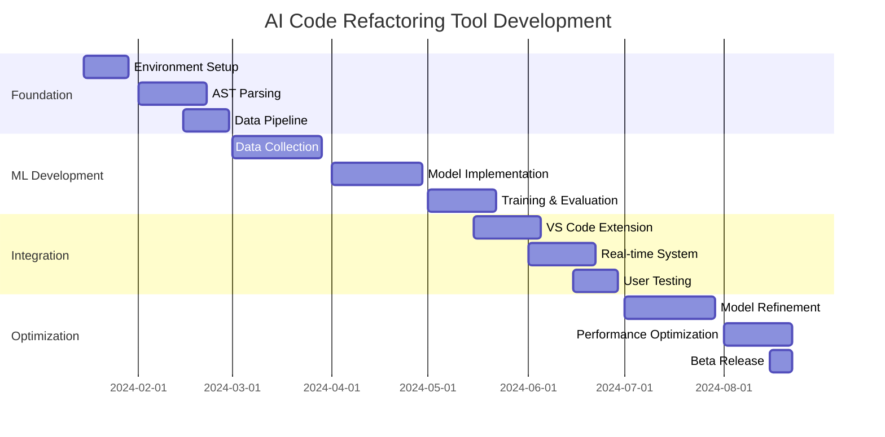

# AI-Powered Code Refactoring Tool

## Abstract

This project aims to develop an intelligent code refactoring tool that leverages machine learning algorithms to analyze code patterns and suggest improvements automatically. By training on large code repositories, the system will learn common refactoring patterns and best practices to assist developers in improving code quality.

## Motivation

Code quality is crucial for software maintainability, but manual refactoring is time-consuming and error-prone. Traditional refactoring tools are limited by predefined rules and patterns, missing opportunities for context-aware improvements. 

Current challenges include:
- **Time-consuming manual process**: Developers spend significant time identifying refactoring opportunities
- **Limited tool capabilities**: Existing tools focus on syntax rather than semantic improvements
- **Knowledge barriers**: Junior developers may not recognize all refactoring opportunities
- **Consistency issues**: Different developers apply refactoring patterns inconsistently

## Technical Approach

### Core Components

#### 1. Code Analysis Engine
```python
class CodeAnalyzer:
    def __init__(self, language='python'):
        self.language = language
        self.ast_parser = ASTParser(language)
        self.pattern_detector = PatternDetector()
    
    def analyze_file(self, file_path):
        """Analyze a single source file for refactoring opportunities"""
        ast_tree = self.ast_parser.parse_file(file_path)
        patterns = self.pattern_detector.detect_patterns(ast_tree)
        return self.generate_suggestions(patterns)
```

#### 2. Machine Learning Pipeline
- **Training Data**: Large corpus of before/after refactoring examples
- **Model Architecture**: Transformer-based sequence-to-sequence model
- **Features**: AST representations, code metrics, contextual embeddings
- **Output**: Ranked list of refactoring suggestions with confidence scores

#### 3. VS Code Integration
```typescript
// VS Code extension integration
export class RefactoringProvider implements vscode.CodeActionProvider {
    async provideCodeActions(
        document: vscode.TextDocument,
        range: vscode.Range
    ): Promise<vscode.CodeAction[]> {
        const suggestions = await this.aiService.getSuggestions(
            document.getText(),
            range
        );
        
        return suggestions.map(suggestion => 
            this.createCodeAction(suggestion)
        );
    }
}
```

### Machine Learning Architecture

#### Model Design
- **Input**: Source code represented as AST tokens
- **Encoder**: Multi-layer transformer encoding code structure
- **Decoder**: Generate refactored code suggestions
- **Attention Mechanism**: Focus on relevant code sections

#### Training Strategy
1. **Data Collection**: Mine GitHub repositories for refactoring commits
2. **Data Preprocessing**: Extract before/after code pairs
3. **Augmentation**: Generate synthetic refactoring examples
4. **Fine-tuning**: Adapt pre-trained code models to refactoring tasks

### Evaluation Framework

#### Automated Metrics
- **Syntax Correctness**: All suggestions must compile/parse correctly
- **Semantic Preservation**: Behavior should remain unchanged
- **Quality Improvement**: Measurable improvements in code metrics
- **Performance Impact**: No degradation in runtime performance

#### Human Evaluation
- **Expert Review**: Professional developers evaluate suggestion quality
- **User Studies**: Measure productivity improvements
- **A/B Testing**: Compare with existing refactoring tools

## Implementation Roadmap

### Phase 1: Foundation (Months 1-2)
- Set up development environment and tooling
- Implement basic AST parsing for target languages
- Create data collection pipeline for training examples
- Develop initial pattern detection algorithms

### Phase 2: ML Development (Months 3-4)
- Collect and preprocess training data
- Implement transformer-based refactoring model
- Train initial models on collected data
- Develop evaluation metrics and test suites

### Phase 3: Integration (Months 5-6)
- Build VS Code extension interface
- Implement real-time suggestion system
- Add user feedback collection mechanisms
- Conduct initial user testing

### Phase 4: Optimization (Months 7-8)
- Refine models based on user feedback
- Optimize performance for real-time use
- Expand language support
- Prepare for beta release

## Technical Challenges

### 1. Context Understanding
**Challenge**: Understanding the broader context of code changes
**Approach**: 
- Use graph neural networks to model code dependencies
- Incorporate project-wide analysis for better context
- Leverage code comments and documentation

### 2. Semantic Preservation
**Challenge**: Ensuring refactored code maintains original behavior
**Approach**:
- Implement automated testing integration
- Use formal verification techniques where possible
- Provide confidence scores for suggestions

### 3. Scale and Performance
**Challenge**: Real-time analysis of large codebases
**Approach**:
- Implement incremental analysis for changed files only
- Use caching strategies for expensive computations
- Optimize model inference for edge deployment

## Expected Outcomes

### Technical Deliverables
- **Open-source refactoring library**: Core algorithms and models
- **VS Code Extension**: User-friendly interface for developers
- **API Service**: Cloud-based refactoring suggestions
- **Research Papers**: Novel techniques and evaluation results

### Impact Metrics
- **Developer Productivity**: 30% reduction in refactoring time
- **Code Quality**: 25% improvement in maintainability metrics
- **Adoption**: 10,000+ active users within first year
- **Community**: 50+ contributors to open-source project

## Research Questions

1. **How can we effectively represent code structure for ML models?**
   - Investigate AST vs. token-based representations
   - Compare different encoding strategies

2. **What makes a refactoring suggestion "good"?**
   - Define quality metrics beyond syntactic correctness
   - Study developer preferences and decision-making

3. **How can we ensure semantic preservation?**
   - Develop automated verification techniques
   - Integrate with existing testing frameworks

## Collaboration Opportunities

### Academic Partnerships
- **Software Engineering Research Labs**: Joint research on code analysis
- **Machine Learning Groups**: Novel model architectures
- **Human-Computer Interaction**: User experience studies

### Industry Collaboration
- **IDE Vendors**: Integration partnerships
- **Tech Companies**: Real-world validation and feedback
- **Open Source Projects**: Community testing and adoption

## Funding Requirements

### Personnel (70% of budget)
- **1 PhD Research Lead**: Model development and research
- **2 Software Engineers**: Tool development and integration
- **1 UX Designer**: Interface design and user studies

### Infrastructure (20% of budget)
- **Computing Resources**: GPU clusters for model training
- **Cloud Services**: Hosting and deployment infrastructure
- **Development Tools**: Professional software licenses

### Other Expenses (10% of budget)
- **Conference Travel**: Present research findings
- **User Studies**: Participant compensation
- **Equipment**: Development hardware

## Timeline and Milestones



## Success Criteria

### Short-term (6 months)
- [ ] Functional prototype with basic refactoring suggestions
- [ ] VS Code extension with 1000+ downloads
- [ ] Published research paper on novel techniques
- [ ] Positive feedback from beta users (4.0/5.0 rating)

### Long-term (12 months)
- [ ] Production-ready tool with multi-language support
- [ ] 10,000+ active users across different platforms
- [ ] Measurable productivity improvements in user studies
- [ ] Industry partnerships for tool integration

## Risk Mitigation

### Technical Risks
- **Model Performance**: Continuous evaluation and improvement
- **Scalability Issues**: Early performance testing and optimization
- **Integration Complexity**: Modular architecture for easier maintenance

### Market Risks
- **Competition**: Focus on unique AI-powered capabilities
- **Adoption Barriers**: Extensive user research and testing
- **Technology Changes**: Flexible architecture for adaptation

This project represents an exciting opportunity to advance the state of automated code improvement tools while providing tangible benefits to the developer community.